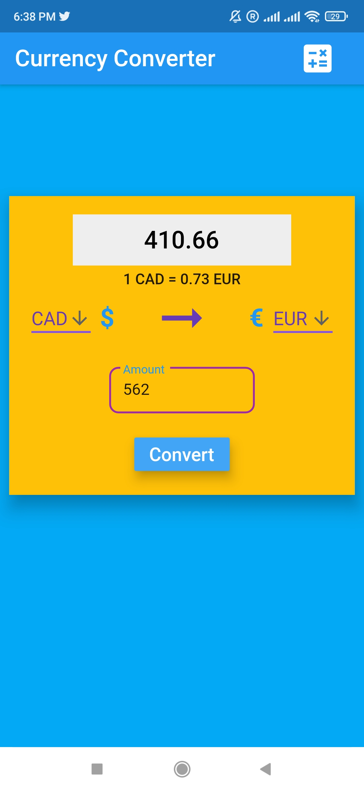
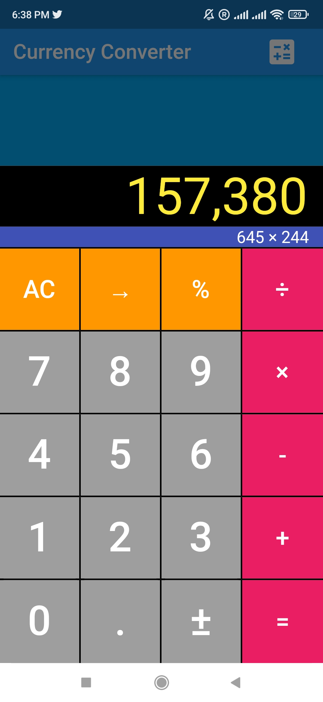

# CurrencyConverter

Flutter based mobile application that uses web-scrapping to show currency conversion between selected countries.
## Features

- Shows currency value between selected countries.
- Several options of currencies.
- Inbuilt calculator.


## Dependencies

- flutter_spinkit: ^4.1.2+1
- web_scraper:
- flutter_simple_calculator: ^1.0.4

## Deployment

To deploy this project download this folder and run 

```bash
  main.dart   // First install all neccessary dependencies listed above or in pubspec file.
```


## Screenshots



<!-- 
 -->


## Demo

Demo Video:

https://drive.google.com/file/d/1o5S4rdMnQqkT_YRQX8D5PoemeSiGLJSo/view?usp=sharing

## Lessons Learned

Learned how to work with web-scrapping and how to represent data dynamically in a mobie app.
## Authors

- [@DhruvDholakia](https://www.github.com/DhruvDholakiaCE)

